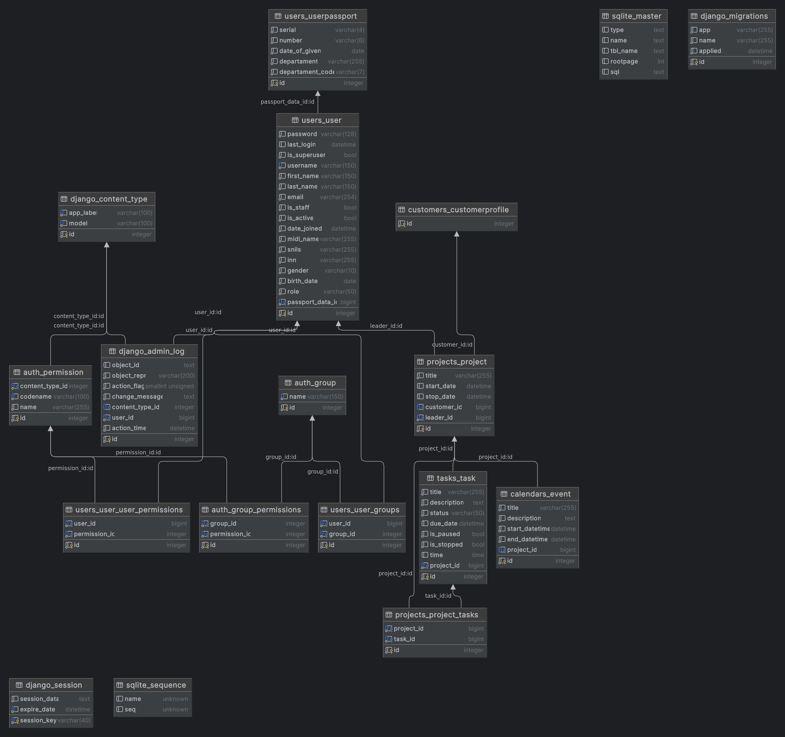

# Проект для КУБ 27

## Стэк

- Python 3.10
- React 18
- Bootstrap 5.3.2
- Node 20.9.0
- Yarn 1.22.19

## Инструкция по развертыванию

Создать `.env` из `.env.example` в директории `cub`.

Создать `.env` из `.env.example` в директории `frontend`.

[//]: # (Установка зависимостей:)

[//]: # ()
[//]: # (```shell)

[//]: # (pip install -r requirements.txt)

[//]: # (```)

[//]: # (```shell)

[//]: # (&#40; cd frontend/src/ && yarn install &#41;)

[//]: # (```)

[//]: # ()
[//]: # (Запуск миграций:)

[//]: # ()
[//]: # (```shell)

[//]: # (python ./cub/manage.py migrate)

[//]: # (```)

[//]: # ()
[//]: # (Запуск приложения:)

[//]: # ()
[//]: # (```shell)

[//]: # (python ./cub/manage.py runserver)

[//]: # (```)

[//]: # (```shell)

[//]: # (&#40; cd frontend/src/ && yarn start &#41;)

[//]: # (```)

[//]: # ()
[//]: # (Админка доступна по адресу http://localhost:8000/admin/)

[//]: # ()
[//]: # (Запуск бота:)

[//]: # ()
[//]: # (```shell)

[//]: # (python ./cub/manage.py bot)

[//]: # (```)

Собрать контейнеры docker:

```shell
docker-compose up
```

## ERD модель базы данных

